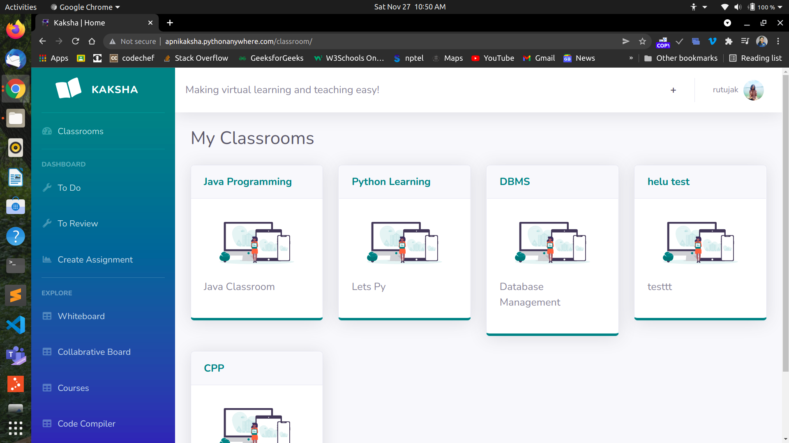
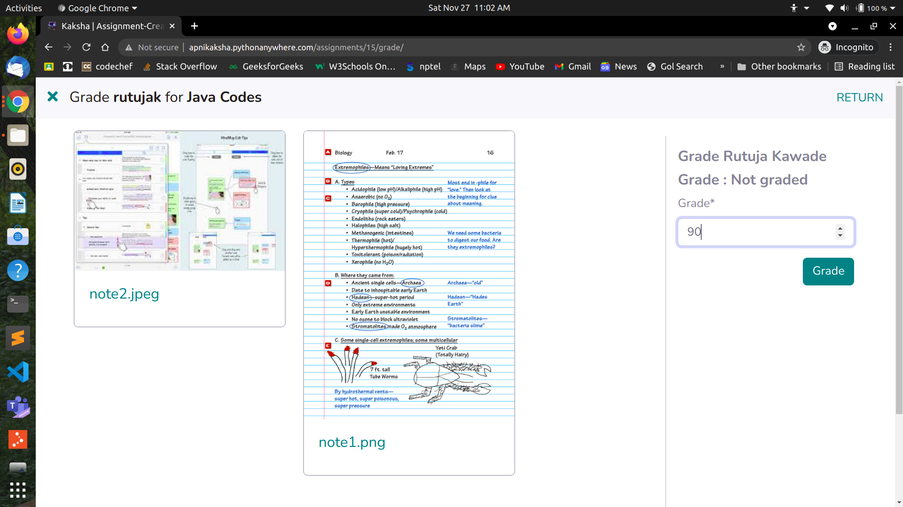

# Kaksha: Project for Microsoft Engage 2021
### Making virtual learning and teaching easy!


## Features & Interfaces 

- Landing Page 

- User registration & Login

- Custom dashboard

- Create Classroom

- Join Classroom

- Add Posts & Comments

- Update User Profile

- Create Assignments 

- Submit Assignments

- Review & Grade Assignments 

- Books Collection

- WhiteBoard 

- Colaborative Whiteboard

- Courses 

- NewsLetter Subscription & Contact Us Form

- Python Intergrated Development Environment (IDE)

- Forgot password 


## Installation

**1. Clone Repository & Install Packages**
```sh
git clone https://github.com/rutujak24/Kaksha.git
pip install -r requirements.txt
```
**2. Setup Environment**
```sh
python -m  venv venv
source venv/bin/activate
``````
OR on Windows
```sh
python -m  venv venv
activate.bat
``````

**3. Migrate & Start Server**
```sh
python manage.py makemigrations
python manage.py migrate
python manage.py runserver
```

